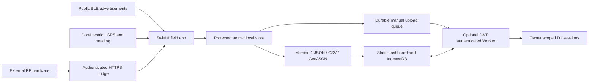

# Architecture

Signal Tracker is a local field instrument with optional sharing. The iPhone owns acquisition and route recording; the static website reviews recordings. Network failure never gates BLE or GPS collection.

## Owners

| Directory | Responsibility |
| --- | --- |
| `ios/SignalTracker/App` | Foreground lifecycle, session coordinator and durable upload checkpoints |
| `ios/SignalTracker/Services` | Independent BLE, location/heading, HTTPS receiver, simulator, authentication and connectivity services |
| `ios/SignalTracker/Features` | Dashboard, hunt, maps, wilderness, spectrum, beacons, sessions and settings |
| `ios/SignalTrackerCore` | Portable Swift models, geometry, estimator, route recovery, atomic storage and exports |
| `packages/core` | TypeScript interchange validation, matching estimator, simulator, exports, protocol and durable queue |
| `web/src` | Static dashboard, canvas renderers, IndexedDB persistence, PKCE and explicit cloud transfers |
| `backend` | HTTPS API, JWT verification, rate limiting, bounded validation and D1 repository |
| `bridge` | Reference transport for packets produced by actual receiver software |

The inspected Java Hello World project was a placeholder. Its Gradle wrapper, Java source and linked Gradle IDE metadata were removed after explicit permission to replace the structure. Existing Git metadata and unrelated IDE preferences were preserved.

## Data contracts

Version 1 JSON is the complete session interchange format. It records UUIDs, ISO 8601 times, target, raw power, unit, provenance, optional location and heading, route segments, estimates, spectrum, waypoints and notes. IDs are normalized to lowercase and dates to UTC on the TypeScript boundary. Swift accepts lowercase and uppercase UUIDs and both fractional and whole-second ISO times.

Imports and API bodies are limited to 2 MB. The schema permits at most 20,000 measurements/route fixes, 1,000 estimates/waypoints and 300 spectrum frames with 2–1,024 bins. Native capture stops at 2,000 power samples or route points; it retains the latest 250 estimates and 128 spectrum frames. These are bounded field sessions, not an unlimited streaming archive. Export before reaching limits or start another session.

Measured readings, calculated regions, simulated observations and explicitly imported `PUBLIC DATABASE` records remain distinct. Measurements from different receivers, targets, frequencies, units or provenance are never pooled by the current estimator. Several HTTPS receivers can operate simultaneously; future calibrated multi-sensor fusion belongs behind `RegionEstimating`/`RegionEstimator`, rather than another recording owner.

## Persistence and lifecycle

Swift uses an actor-owned atomic JSON file in Application Support. Revisions prevent older asynchronous snapshots from overwriting newer ones. iOS applies file protection; queue checkpoints are awaited before upload. Failed saves retain the previous file and show an error. Interrupted foreground sessions close at their last persisted observation on restart. A crash can lose observations since the last checkpoint, normally up to approximately three seconds.

The web repository uses IndexedDB transactions. Outbox mutations and cloud actions are serialized. Both clients use idempotent PUT by owner/session UUID. Manual downloads preserve pending local edits; other matching local sessions are replaced by the downloaded version. Upload replaces the cloud copy. This is explicit replacement synchronization, without collaborative merge or revision-conflict resolution.

JWT issuer, audience, expiry, algorithm and signature are checked server-side. The server derives its owner key from issuer and subject, never a client-supplied owner. D1 keys include owner and session ID. Pagination uses start time plus ID, preserving sessions with identical timestamps. The API is disabled until configured.

## Extension seams and current boundaries

Add hardware adapters through `SignalReceiver`; normalize power units without inventing calibration. Add a licensed terrain provider through the mapping provider interface. The default offline renderer needs no tiles. Only the web dashboard currently imports public infrastructure layers. Direct arbitrary RF, Wi-Fi/cellular scanning and SDR USB drivers are not implemented on iOS. See [hardware](HARDWARE.md), [offline behavior](OFFLINE_MODE.md) and [verification evidence](VERIFICATION.md).
